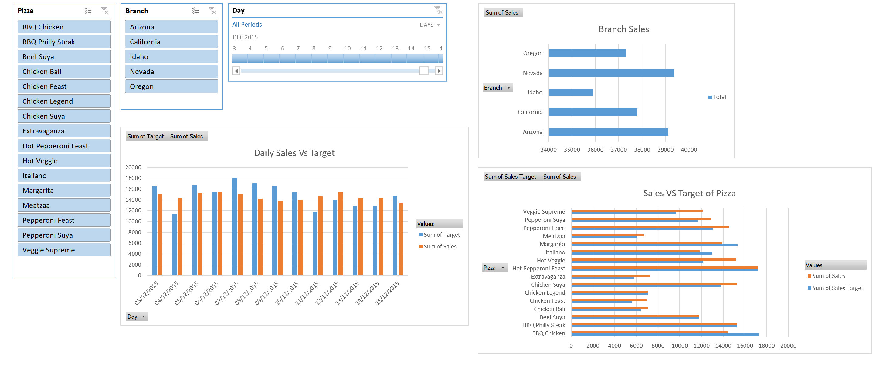

# Abdul Rahman Kadri - Data Analysis Portfolio

## About

Hi, I'm Abdul Rahman! I am a highly motivated graduate with a passion for data analysis. I have expertise in Excel, including pivot tables, data visualisation, data modelling, and SQL, with knowledge of stored procedures, CTEs, T-SQL, and SSMS. I also have experience with Power BI, including data visualisation, data modelling, and creating dashboards and reports.

 ---

> My CV in [pdf](https://github.com/aokadri11/AbdulRahman_Portfolio/blob/main/Abdul_Rahman_Kadri_CV_2023_Data_Analysis.pdf) 
---

This repository that I have created to showcase my skills and contains my Data Analytics portfolio projects ranging from SQL, PowerBi and Excel.

---

## Table of Contents
- [About](#about)

- [Power BI](#power-bi)

- [SQL Query](#sql-query)  

- [Excel](#excel)

---

## **Power Bi**  

## **SQL Query** 

## **Excel**  

*Kindly download these Excel files from this repository and view them in Microsoft Excel.*

- Pizza Sales: Sales Target Dashboard  

- Data Cleaning Exercise1 - AmericaNewBank in [DCE1](https://github.com/aokadri11/AbdulRahman_Portfolio/blob/main/Abdul%20-%20AmericaBank%20-%20PB.xlsx)

- Data Visualisation Exercise1 - Olympic Atheleths [DVE1](https://github.com/aokadri11/AbdulRahman_Portfolio/blob/main/Abdul%20-%20Olympic%20Atheleths.xlsx)
